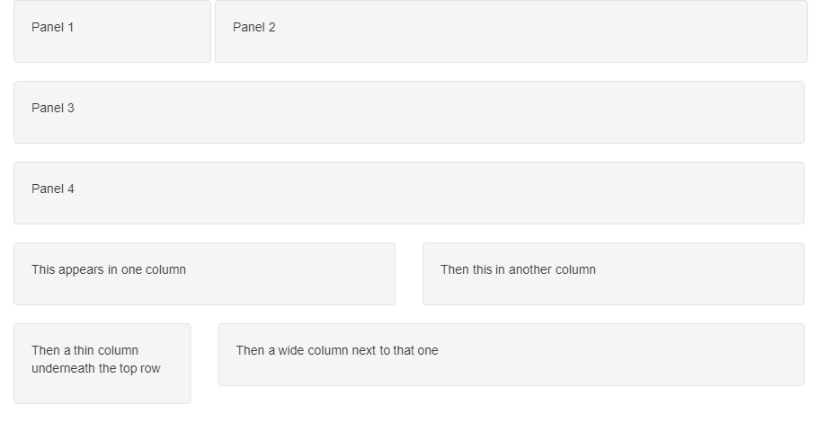
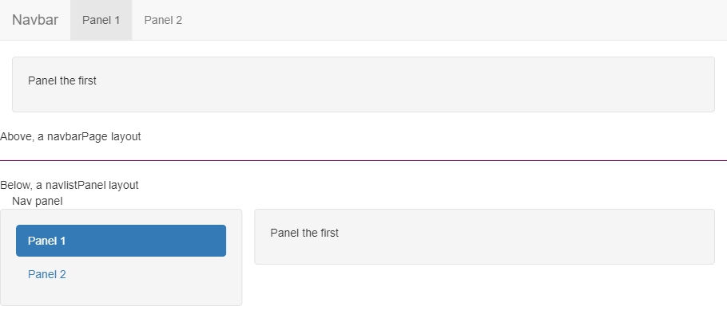
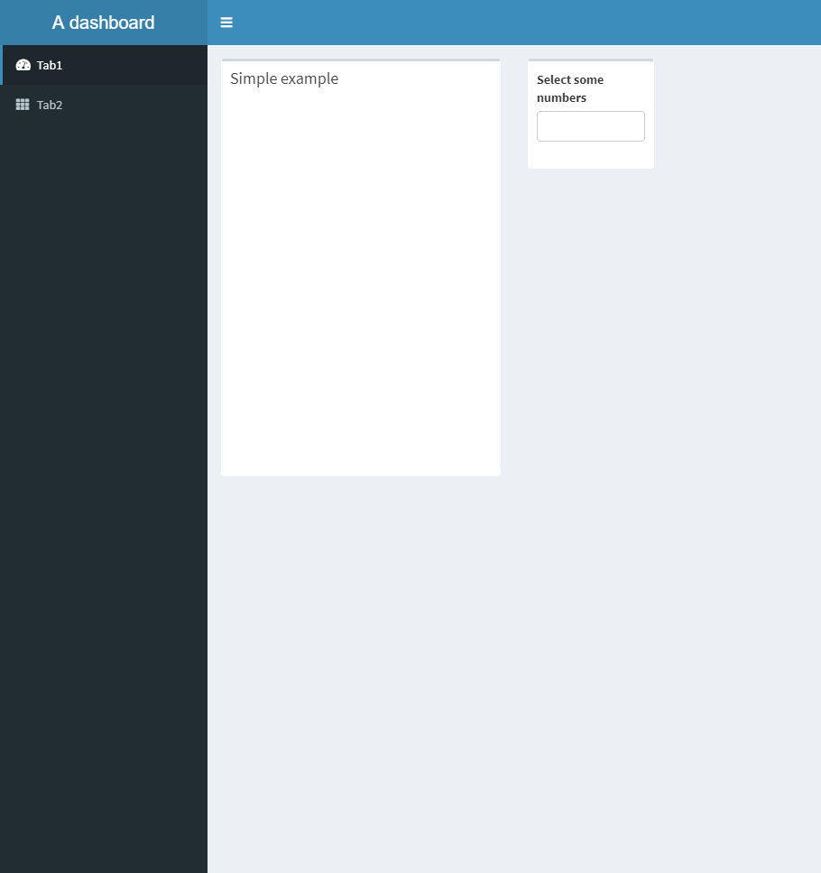

```{r setup, include=FALSE}
knitr::opts_chunk$set(echo = TRUE)
library(shiny)
library(shinyscreenshot)
```

## Create a new Shiny app

File > New File > Shiny Web App...
Enter name for app, set as single file app (if not already selected) and choose directory.
Finally, click Create.

## Basic Shiny

### UI

#### Inputs

```
{typeOfInput}Input(inputId, label, ...)
# e.g. textInput("title" "Enter title:")
```

Access inputs with input$inputId.

#### Outputs

```
{typeOfOutput}Output(outputId, ...)
# e.g. plotOutput("line_graph")
```

Access outputs with output$outputId.

### Server

#### Rendering output

```
output$outputId <- render{typeOfOutput}({
  # output code
})

# e.g. 

output$line_graph <- renderPlot({
  plot(1:10, main = input$title)
 })

```

#### Reactive expressions

```
reactiveData <- reactive({
  return_data %>%
  ...
})

output$table <- renderDT({
  returnData() %>%
  ...
})
```

### Example

```
ui <- fluidPage(
  
  textInput("myInput", "I'm a text input!"),
  textOutput("myOutput")
)

server <- function(input, output, session) {
  
  reactiveText <- reactive({
    upper(input$myInput)
  })
  
  output$myOutput <- renderText({
    reactiveText() # Reference a reactive expression - it is not a function!
  })
}

shinyApp(ui, server)
```

## Debugging

- Start simple
- Make sure your code works outside of Shiny! One way of writing Shiny apps is known as **markdown first**; you write your code in RMarkdown initially, and only once everything (or some logical unit of the whole code) is working, only then create (or add to) a Shiny app
- Use the `cat()` or `print()` functions
- Breakpoints and `browser()`
- Run `options(shiny.reactlog=TRUE)`, run the app and press `Ctrl+F3` for an interactive summary of reactive activity

## Tabset panels and conditional UI

Separate content into tabs using `tabsetPanel` and `tabPanel`. Use the `value` argument of `tabPanel` as a way of detecting which tab is currently selected.

Use `conditionalPanel` with a JavaScript `condition` statement to change the UI depending on the currently selected tab.

```
sidebarLayout(
    sidebarPanel(
      
      conditionalPanel(
        condition = "input.tabset == 'graph'",
        selectInput("trust",
                    "Select Trust",
                    choices = unique(ae_attendances$Name),
                    multiple = TRUE)
      )),
    
    mainPanel(
      tabsetPanel(id = "tabset",
                  tabPanel("Graph", value = "graph", plotOutput("graph")),
                  tabPanel("Map", value = "map", 
                           leafletOutput("trustMap", height = 600, width = 500)
                  ))
    )
  )
```

## Dynamic UI

Create dynamic UI elements using `uiOutput` and `renderUI`.

```
ui <- fluidPage(
  ...
  uiOutput("dateRangeUI"),
  ...
)

server <- function(input, output) {
  ...
  output$dateRangeUI <- renderUI({
    
    dateRangeInput("date", "Date range", 
                   min(ae_attendances$period), 
                   max(ae_attendances$period),
                   startview = "year")
  })
  ...
```

## Validation of app state

### `req`

Simply stops further running of a code block when some value is not set. Below, any further code will not run until both `input$trust` and `input$year` has a value.

```
req(
  input$trust,
  input$year
)
...
```

### `validate`

Same as `req`, but also allows for a message to be displayed when an expected value is not set. Each message below will be displayed according to the truthiness of `input$trust` and `input$year`. Once both have a truthy value, the messages will not be displayed and any further code will be run.

```
validate(
  need(input$trust, "Please select a trust"),
  need(input$year,  "Please select a year")
)
...
```

## Layout functions

### Non-navigable layouts

When using `fluidRow` and `column`, remember that a full row consists of 12 units.
The `splitLayout` function allows for fine-grained control over exact column splits.
A simple way to get a single column of UI, with each element on it's own row, is `verticalLayout`. These are just some commonly used layouts, see the Shiny documentation for more examples.

```{r, non-nav-layouts, include = FALSE}

ui <- fluidPage(id = "wrapper",
  
  splitLayout(
    cellWidths = c("25%", "75%"),
    wellPanel(p("Panel 1")),
    wellPanel(p("Panel 2"))
  ),
  verticalLayout(
    wellPanel(p("Panel 3")),
    wellPanel(p("Panel 4"))
  ),
  fluidRow(
    column(width = 6, wellPanel(p("This appears in one column"))
    ),
    column(width = 6, wellPanel(p("Then this in another column"))
    )
  ),
  fluidRow(
    column(width = 3, wellPanel(p("Then a thin column underneath the top row"))),
    column(width = 9, wellPanel(p("Then a wide column next to that one")))
  )
)

server <- function(input, output) {
  screenshot(selector = "#wrapper", download = FALSE, server_dir = "./non-nav-layouts/")
}

shinyApp(ui = ui, server = server)


```

```
ui <- fluidPage(
  splitLayout(
    cellWidths = c("25%", "75%"),
    wellPanel(p("Panel 1")),
    wellPanel(p("Panel 2"))
  ),
  verticalLayout(
    wellPanel(p("Panel 3")),
    wellPanel(p("Panel 4"))
  ),
  fluidRow(
    column(width = 6, wellPanel(p("This appears in one column"))
    ),
    column(width = 6, wellPanel(p("Then this in another column"))
    )
  ),
  fluidRow(
    column(width = 3, wellPanel(p("Then a thin column underneath the top row"))),
    column(width = 9, wellPanel(p("Then a wide column next to that one")))
  )
)

server <- function(input, output) {}

shinyApp(ui = ui, server = server)
```



### Navigable layouts

Two commonly used layouts are `navbarPage` and `navlistPanel`. The former is generally used in place of `fluidPage` to wrap an entire page of UI. The latter can be used with `fluidPage` to add navigation on the left of the page.

```{r, navbar-layout, include = FALSE}


ui <- div(id = "wrapper",
  
  navbarPage("Navbar",
    tabPanel("Panel 1",
      wellPanel(p("Panel the first"))
    ),
    tabPanel("Panel 2",
      wellPanel(p("Panel the second"))
    )
  ),
  "Above, a navbarPage layout",
  tags$hr(style="border-color: purple;"),
  "Below, a navlistPanel layout",
  fluidPage("Nav panel",
    navlistPanel(
      tabPanel("Panel 1",
        wellPanel(p("Panel the first"))
      ),
      tabPanel("Panel 2",
        wellPanel(p("Panel the second"))
      ) 
    )
  )
)

server <- function(input, output) {
  screenshot(selector = "#wrapper", download = FALSE, server_dir = "./nav-layouts/")
}

shinyApp(ui = ui, server = server)

```

```
ui <- div(
  navbarPage("Navbar",
    tabPanel("Panel 1",
      wellPanel(p("Panel the first"))
    ),
    tabPanel("Panel 2",
      wellPanel(p("Panel the second"))
    )
  ),
  fluidPage("Nav panel",
    navlistPanel(
      tabPanel("Panel 1",
        wellPanel(p("Panel the first"))
      ),
      tabPanel("Panel 2",
        wellPanel(p("Panel the second"))
      ) 
    )
  )
)

server <- function(input, output) {}

shinyApp(ui = ui, server = server)
```



## RMarkdown reports

You can use RMarkdown to create reports that can then be downloaded by a user via a Shiny app.

### Shiny side

In the UI add a `downloadButton` that will initiate the report download.

```
ui <- ...(
  ...
  downloadButton("downloadReport", "Download report")),
  ...  
)
```

In the server create the corresponding output using `downloadHandler`. You can add some validation here. Note the `params` list - the contents of this list will be passed to RMarkdown.

```
server <- function(input, output) {
  
  output$downloadReport <- downloadHandler(
    filename = "report.docx",
    content = function(file){
      
      if(!isTruthy(input$trust)){
        
        showModal(
          modalDialog(
            title = "Error!",
            HTML("Please select a trust first"),
            easyClose = TRUE
          )
        )
      }
      
      params <- list(date_from = input$date[1],
                     date_to = input$date[2],
                     trust = input$trust)
      
      render("report.Rmd", output_format = "word_document",
             output_file = filename, quiet = TRUE, params = params,
             envir = new.env(parent = globalenv()))
      
      # copy docx to 'file'
      file.copy(filename, file, overwrite = TRUE)
    }
  )
  
}
```

### RMarkdown side

Use the `params` passed by the Shiny app to create the report. These must be specified in the YAML frontmatter.

```
---
...
params: 
  date_from : NA
  date_to : NA
  trust : NA
---
```

They can be used just like `input` and `output` in Shiny.

```
report_data <- ae_attendances  %>% 
  filter(period >= params$date_from, period <= params$date_to,
         Name %in% params$trust)

# Add the contents of the report now, e.g. tables, plots, maps
```

## Shinydashboard

A simple way of creating Shiny dashboards is with the shinydashboard package.

```{r, shinydashboard-layout, include = FALSE}

library(shinydashboard)

ui <- div(id = "wrapper",
  dashboardPage(
    dashboardHeader(title = "A dashboard"),
    dashboardSidebar(
      sidebarMenu(id = "tabset",
                  menuItem("Tab1", tabName = "tab1", icon = icon("dashboard")),
                  menuItem("Tab2", tabName = "tab2", icon = icon("th"))
      ),
      uiOutput("dateRangeUI")
    ),
    dashboardBody(
      tabItems(
        # First tab content
        tabItem(tabName = "tab1",
                fluidRow(
                  box(title = "Simple example",
                      plotOutput("graph")),
                  box(width = 3, 
                      selectInput("numbers",
                                  "Select some numbers",
                                  choices = 1:10,
                                  multiple = TRUE)
                      )
                  )
        ),
        
        # Second tab content
        tabItem(tabName = "tab2")
      )
    )
  )
)

server <- function(input, output) {
  screenshot(selector = "#wrapper", download = FALSE, server_dir = "./shinydashboard-layout/")
}

shinyApp(ui = ui, server = server)

```

```
ui <- dashboardPage(
  dashboardHeader(title = "A dashboard"),
  dashboardSidebar(
    sidebarMenu(id = "tabset",
                menuItem("Tab1", tabName = "tab1", icon = icon("dashboard")),
                menuItem("Tab2", tabName = "tab2", icon = icon("th"))
    ),
    uiOutput("dateRangeUI")
  ),
  dashboardBody(
    tabItems(
      # First tab content
      tabItem(tabName = "tab1",
              fluidRow(
                box(title = "Simple example",
                    plotOutput("graph")),
                box(width = 3, 
                    selectInput("numbers",
                                "Select some numbers",
                                choices = 1:10,
                                multiple = TRUE)
                    )
                )
      ),
      
      # Second tab content
      tabItem(tabName = "tab2",
              ...
      )
    )
  )
)
```



## Value boxes

A value box is an element commonly found on dashboards and is used to highlight a specific single value.

```
ui <- ...(
  ...
  valueBoxOutput("valueBox1")
  ...
)

server <- function(input, output) {
  
  output$valueBox1 <- renderValueBox({
    
    valueBox(
      input$date[2] - input$date[1],
      "Days summarised", 
      icon = icon("calendar-alt"),
      color = "green"
    )
  })
}
```

## Deployment

There are many ways of deploying your app for others to use.

- runGitHub(“gapminder”, “ChrisBeeley”)
- runUrl(“http://www.myserver/shinyapps/myshinyapp.zip”)
- runGist(“6571951”)
- Just stick it in a shared area and get people to run it themselves
- shinyapps.io
- ShinyProxy
- Proxied authentication (Apache/ Nginx)
- Paid (RStudio Connect/ Shiny Pro)
- Cloud/ firewalled